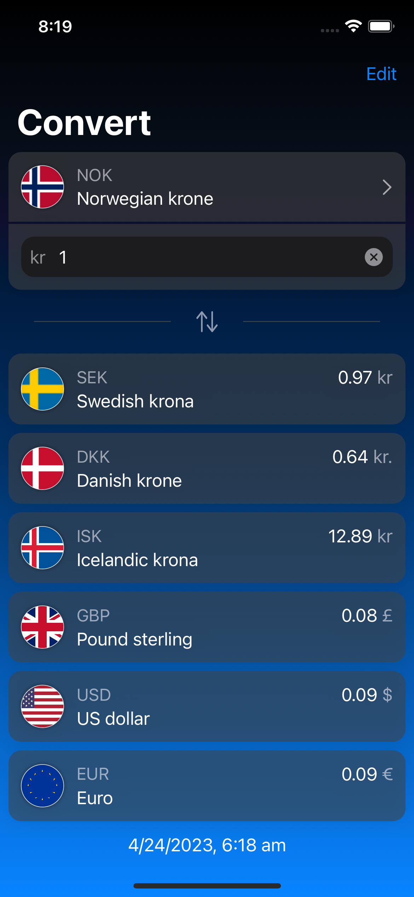

# Currency Insight

test 3

## Overview
Currency Insight is an iOS app that converts currencies. The app uses data from Norges Bank's open API for fetching exchange rates.

## Features
- Currency Converter: converts a specific amount of base currency to quote currencies. The quote currencies can be long-tapped to set them as the base currency, and the base can also be selected from a searchable currency selection view.
- Cross-Course Method: All data from Norges Bank can only be recived with NOK as the quote currency, so to use any other currencies as the base and quote currency this cross-cource method is applied.
- Formatted Input: The TextField for input of text is formatted on the fly.
- Dark and Light Mode: The app is designed to work in both dark and light mode, but not much energy is put into it, it's more to show how'
- For iPhone >= iOS 15.5, not tested for how low it can go.

## Dependencies
Norges Bank's open API for fetching exchange rates.

## Installation and Usage
1. Clone the repository to your local machine.

## Contributing
If you have suggestions or find any issues, feel free to open an issue or pull request on GitHub.

## License
Currency Insight is licensed under the [MIT license](https://opensource.org/licenses/MIT).

## Acknowledgements
- Norges Bank for providing the open API for fetching exchange rates.

## Roadmap / TODOs / 
- Fallbacks
- Unit testing
- Snapshot testing
- Localization
- Logging
- ++

Please note that Currency Insight is not a fully featured app, but rather a demonstration of how I do this with Swift, SwiftUI, and MVVM architecture.
